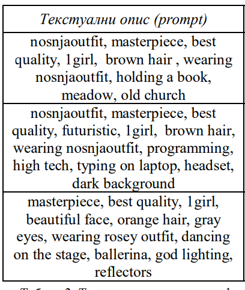
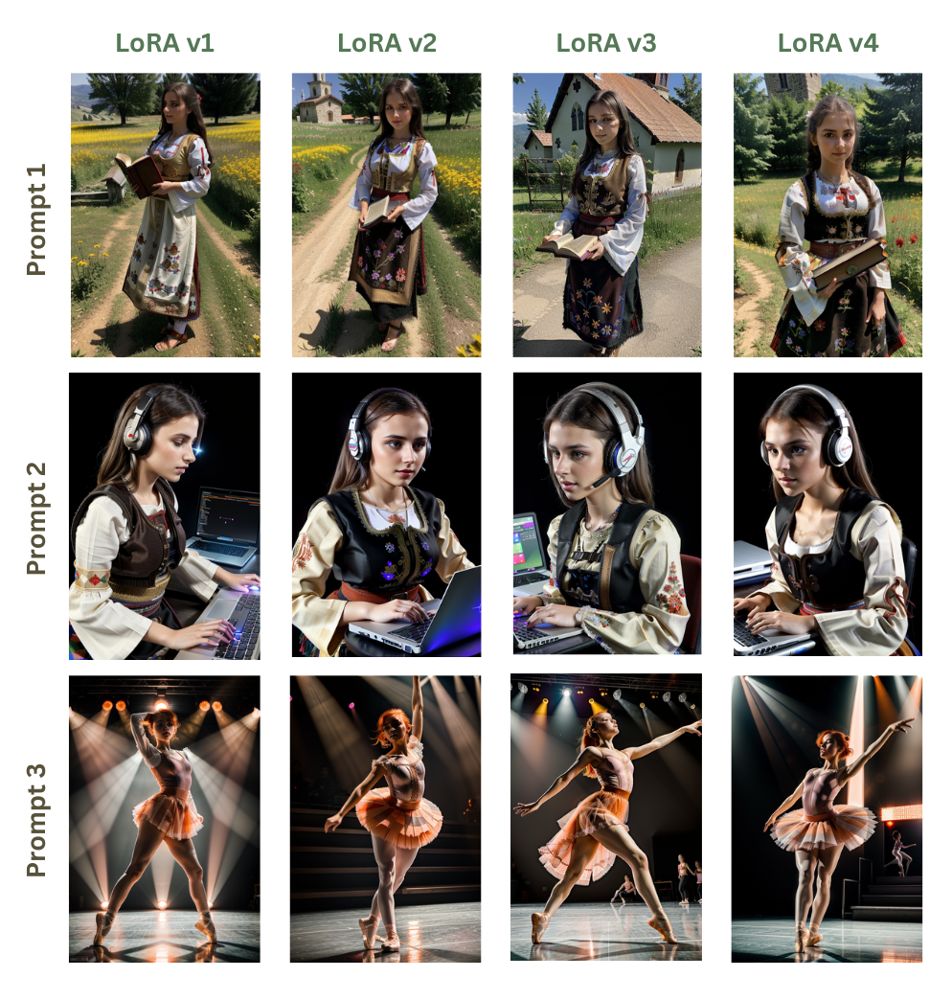
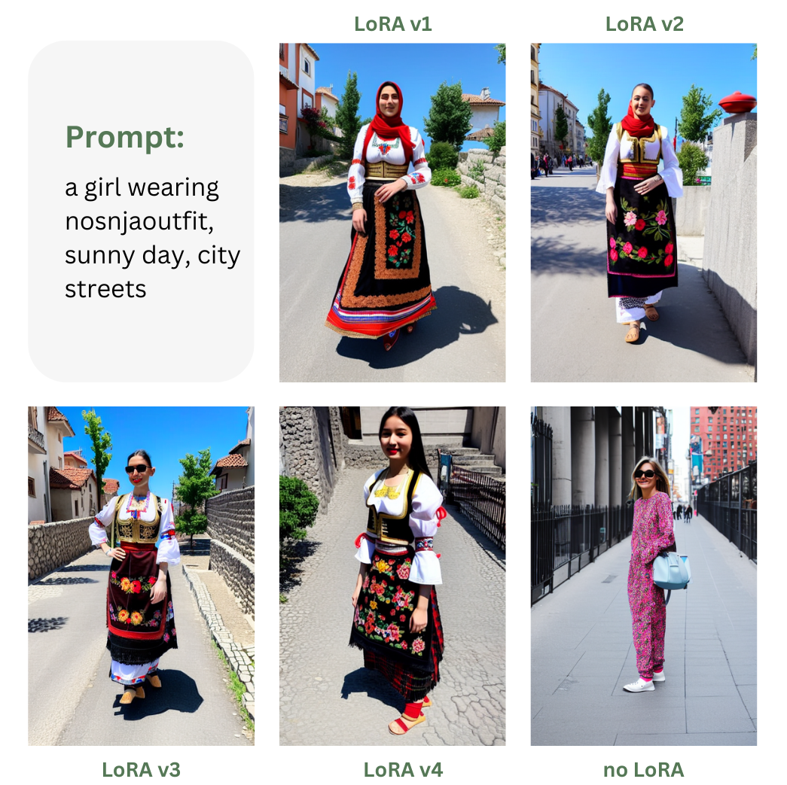
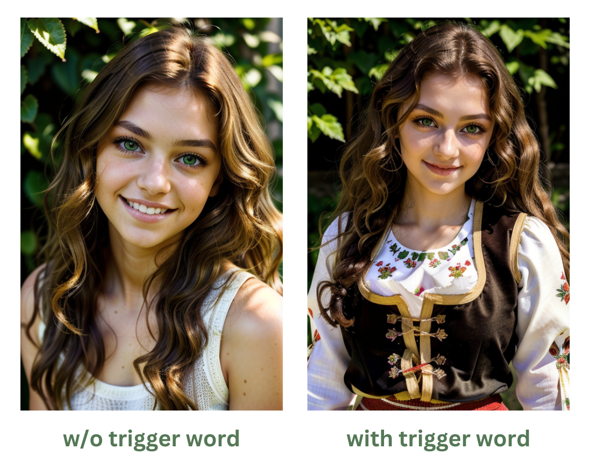

# Bachelor Thesis: Fine-tuning Stable Diffusion using the LoRA method

Applying the `LoRA method` to fine-tune the `Stable Diffusion v1.5` base model, on the task of learning to generate `Serbian traditional clothing` ("narodna nosnja").

The thesis is a continuation of the project I worked on during my internship on diffusion models and later studies. I find diffusion models utterly fascinating, so continuing to work on them for my thesis was the obvious choice. The aim of the thesis is to further hone the theoretical knowledge, methodology, and evaluation metrics of my previous work.

### Repository contents
- `Thesis presentation.pdf` - presentation slides for the project 
- `SD_LoRA_trainer.ipynb` - notebook used for fine-tuning Stable Diffusion with LoRA
- `dataset/` - folder containing images used for training
- `labels/` - folder containing labels used for training
- `lora files/` - folder containing the produced LoRA safetensors files
- `demo images/` - folder containing representative results generated by different Stable Diffusion models and produced LoRAs
- `evals/` - folder containing evaluation results used for verification and investigation across different checkpoints and hyperparameter configurations

### Results
During training with different hyperparameter tunning, dataset, and label tweaks, 4 successful versions of clothing "narodna nosnja" LoRAs were chosen:
- v1
- v2
- v3
- v4

All four give satisfactory results and can generate images of girls wearing traditional Serbian clothing with high accuracy and generalization ability.

The LoRA files are available in the `lora files/` folder. I highly encourage the readers to download and try them out for themselves :)

### Evaluation
The evaluation of `text-to-image` models is an open field of research. 
Current best practice is to combine qualitative and quantitative methods when testing the models performance.
Consequently, this thesis implements both.

#### Qualitative evaluation
Qualitative evaluation was done by conditioning all four LoRA models on the same set of prompt. Three separate prompts were constructed, each testing for a specific sucess metric:
1. Concept in natural setting - learning from given data
2. Concept in non-natural setting - generalizing new contexts
3. No concept - preserving prior knowledge

The prompts used:

The resulting images:

#### Quantitative evaluation
Quantitative evaluation metrics for diffusion models vary based on the type of task. For text-to-image generation, `CLIP score` metrics is a common choice.
CLIP score uses the CLIP model to calculate the embeddings of the given prompt and the generated image. Semantic similarity between the text and the image is then calculated as the cosine distance between the two vectors in the same vector space.

The prompt and the images used for generating CLIP scores for each LoRA:

The results and discussion can be found in the [Thesis Presentation](Thesis presentation.pdf).

#### Trigger-word test
To further evaluate the successfulness of the training, the effect of the trigger word was evaluated.

Images generated with developed LoRA, without and with the trigger word at the start of the prompt:

### Running inference

To try out the LoRA's, you can load them into any Stable Diffusion UI of your choice and use them with any checkpoint model, like any other LoRA (or use them in code, however you like to do your inference).

If you don't have a UI in mind, you can use the `Srpska_Nosnja_LoRA_SD_fine_tuning.ipynb` by following these steps:
- use section *2.1. Download Available Model* or *2.2.  Download Custom Model* to download SD checkpoint of your choice
- navigate to section *6.3. Inference*:
  - upload LoRA file of your choice to Colab's files
  - copy path to LoRA, and paste it into *network_weight* field
  - leave *matmul* at 0.85 or more
  - upload model to Colab's files, copy path and paste to *model* field
  - write any *prompt* and *negative prompt*, but be sure to use the guidelines for prompting listed below
  - 30 *steps*, *cfg scale* 7, ddim *sampler*, *clip skip* 1 - for hyperparameters

Be sure to put **trigger word**: `nosnjaoutift` at the start of the prompt, and include `wearing traditional nosnjaoutfit` in the prompt as well, for best results. \
